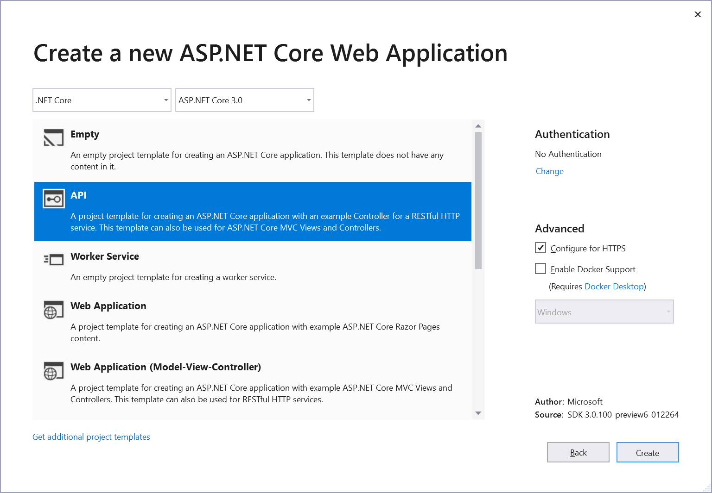
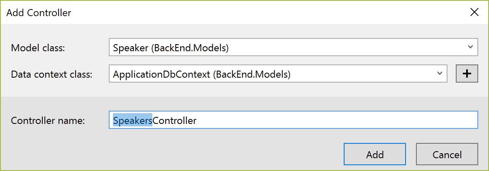
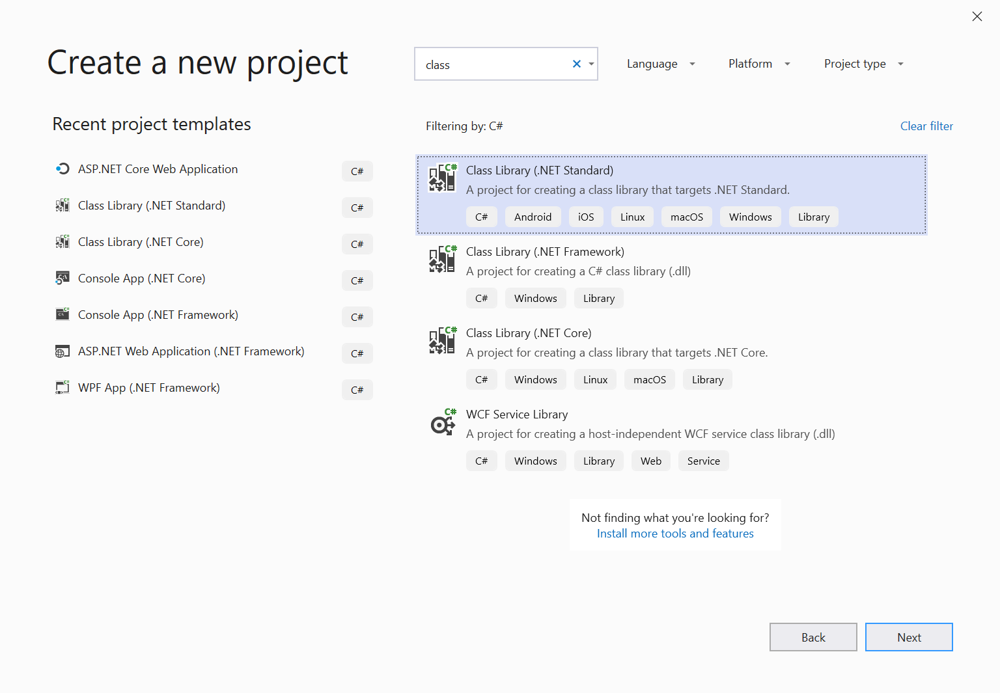

## Creating a new project using Visual Studio

1. Create and add a new project named BackEnd and name the solution ConferencePlanner using File / New / ASP.NET Core Web Application. Select the Web API template, No Auth, no Docker support.




> **Note:** If not using Visual Studio, create the project using `dotnet new webapi` at the cmd line, details as follows:
>
> i. Create folder ConferencePlanner and call `dotnet new sln` at the cmd line to create a solution
>
> ii. Create sub-folder BackEnd and create a project using `dotnet new webapi` at the cmd line inside the folder BackEnd
>
> iii. From the ConferencePlanner folder, add the project to the solution using `dotnet sln add BackEnd/BackEnd.csproj`

2. Add a new `Models` folder to the BackEnd project.

3. Add a new `Speaker` class inside the Models folder using the following code:

```csharp
using System;
using System.Collections.Generic;
using System.ComponentModel.DataAnnotations;
using System.Linq;
using System.Threading.Tasks;

namespace BackEnd.Models
{
    public class Speaker
    {
       public int Id { get; set; }

       [Required]
       [StringLength(200)]
       public string Name { get; set; }

       [StringLength(4000)]
       public string Bio { get; set; }

       [StringLength(1000)]
       public virtual string WebSite { get; set; }
    }
}
```

4. Add a reference in the BackEnd project to the NuGet package `Microsoft.EntityFrameworkCore.SqlServer` version `9.0.1.`

> This can be done from the command line in the `BackEnd` folder using `dotnet add package Microsoft.EntityFrameworkCore.SqlServer` --version `9.0.1`

5. Add a reference in the BackEnd project to the NuGet package `Npgsql.EntityFrameworkCore.PostgreSQL` --version `9.0.3`

> This can be done from the command line in the `BackEnd` folder using `dotnet add package Npgsql.EntityFrameworkCore.PostgreSQL` --version `9.0.3`

6. Next we'll create a new Entity Framework DbContext. Create a new `ApplicationDbContext` class in the `Models` folder using the following code:

```csharp
using Microsoft.EntityFrameworkCore;

namespace BackEnd.Models
{
    public class ApplicationDbContext : DbContext
    {
        public ApplicationDbContext(DbContextOptions<ApplicationDbContext> options)
            : base(options)
        {

        }

        public DbSet<Speaker> Speakers { get; set; }
    }
}
```
7. Add a connection string to the `appsettings.json` file for this database:

```csharp
{
  "ConnectionStrings": {
    "DefaultConnection": "Host=localhost;Port=5432;Database=YourDatabaseName;Username=YourUsername;Password=YourPassword"
  },
  "Logging": {
    "LogLevel": {
      "Default": "Warning",
      "Microsoft": "Warning",
      "Microsoft.Hosting.Lifetime": "Information"
    }
  },
  "AllowedHosts": "*"
}
```
## Register the DB Context Service

1. Add the following code to the top of the `builder.Build();` method in `Program.cs`:

```csharp
string connectionString = builder.Configuration.GetConnectionString("DefaultConnection");

builder.Services.AddDbContext<ApplicationDbContext>(options =>
{
    options.UseNpgsql(connectionString);
});
```
> This code registers the `ApplicationDbContext` service so it can be injected into controllers. Additionally, it configures operating system specific database technologies and connection strings

2. Ensure the following `using` statements are at the top of the Program.cs file to allow the references in our code to work

```csharp
using BackEnd.Models;
using System.Runtime.InteropServices;
using Microsoft.EntityFrameworkCore;
```
## Configuring EF Migrations

1. Add a reference to the NuGet package `Microsoft.EntityFrameworkCore.Tools` --version `9.0.1`.
> If you're not using Visual Studio install the package from the command line in the `BackEnd` folder with `dotnet add package Microsoft.EntityFrameworkCore.Tools --version 9.0.1`

**Visual Studio: Package Manager Console**

1. In Visual Studio, select the Tools -> NuGet Package Manager -> Package Manager Console

2. Run the following commands in the Package Manager Console

```csharp
Add-Migration Initial
Update-Database
```
**Command line**

1. Install the EntityFramework global tool `dotnet-ef` using the following command in the `BackEnd` folder:

```markdown
dotnet tool install -g dotnet-ef --version 3.1.3
```
2. Open a command prompt and navigate to the project directory. (The directory containing the `Program.cs` file).

3. Run the following commands in the command prompt:

```markdown
dotnet build
dotnet ef migrations add Initial
dotnet ef database update
```
## Commands Explained
| **Command** | **Description** |
|-------------|-----------------|
| `dotnet ef migrations add Initial` / `Add-Migration Initial` | generates code to create the initial database schema based on the model specified in `ApplicationDbContext.cs`. `Initial` is the name of the migration. |
| `dotnet ef database update` / `Update-Database` | creates the database |

> For more information on these commands and scaffolding in general, see [this tutorial](https://learn.microsoft.com/en-us/aspnet/core/tutorials/first-mvc-app/adding-model)

> If your database ever gets in a bad state and you'd like to reset things, you can use `dotnet ef database drop` followed by `dotnet ef database update` to remove your database and run all migrations again.

## A quick look at the Weather Forecast Controller

First, open the `Controllers` folder and take a quick look at the `WeatherForecastController`. You'll see a simple function that corresponds to the HTTP GET verb. You'll see the output of this controller in a bit, but first we'll build our own API controller for the `Speakers` model class.

## Scaffolding an API Controller

**Using Visual Studio**

1. Right-click the `Controllers` folder and select Add/Controller. Select "API Controller with actions, using Entity Framework".

2. In the dialog, select the `Speaker` model for the Model Class, `ApplicationDbContext` for the "Data Context Class" and click the Add button.



**Using the cmd line**

1. Install the "Microsoft.VisualStudio.Web.CodeGeneration.Design" package

```markdown
dotnet add package Microsoft.VisualStudio.Web.CodeGeneration.Design --version 9.0.0
```
2. Install the `aspnet-codegenerator` global tool by running the following command:

```markdown
dotnet tool install --global dotnet-aspnet-codegenerator --version 9.0.0
```
> Note: You will need to close and reopen the console window to be able to use this tool.

3. Run the following in the project folder at the cmd line

```markdown
dotnet aspnet-codegenerator controller -api -name SpeakersController -m Speaker -dc BackEnd.Models.ApplicationDbContext -outDir Controllers
```
## Testing the API using the Swashbuckle

1. Add a reference to the NuGet package `Swashbuckle.AspNetCore` --version `7.2.0`

> This can be done from the command line using `dotnet add package Swashbuckle.AspNetCore --version 7.2.0`

2. Add the Swashbuckle services in your Program.cs:

```csharp
builder.Services.AddSwaggerGen(options =>
    options.SwaggerDoc("v1", new OpenApiInfo 
    { 
        Title = "Conference Planner API", 
        Version = "v1" 
    })
);
```
3. Ensure your `Program.cs` file contains the following 'using' statements:

```csharp
using Microsoft.OpenApi.Models;
using System.Threading.Tasks;
```
4. Configure Swashbuckle by adding the following lines just before `UseRouting` in the `Configure` method in `Program.cs`:

```markdown
app.UseSwagger();

app.UseSwaggerUI(options =>
    options.SwaggerEndpoint("/swagger/v1/swagger.json", "Conference Planner API v1")
);
```
5. Add a MapGet to the beginning of the `app.MapGet()` statement in the pipeline that redirects requests from the root of our application to the swagger end point.

```csharp
app.MapGet("/", context =>
{
    context.Response.Redirect("/swagger/");
    return Task.CompletedTask;
});
```
6. Run the application (F5 in Visual Studio or `dotnet run` from console).

## Building out the Back End

In this session, we'll add the rest of our models and controllers that expose them. We'll also refactor our application, moving our DTOs to a shared project so they can be used by our front-end application later.

## Add a ConferenceDTO project

> We'll start by creating the new shared project to hold our data transfer objects. 

**Adding the ConferenceDTO Project using Visual Studio**

1. If using Visual Studio, right-click on the Solution and select *Add / New Project....*
2. Select *.NET Standard* from the project types on the left and select the *Class Library (.NET Standard)* template. Name the project ConferenceDTO and press OK.

3. Delete the generated `Class1.cs` file from this new project.
4. Right-click the 'Dependencies' node under the BackENd project, select "Add Reference..." and put a checkmark near ConferenceDTO.

**Adding the ConferenceDTO project via the Command Line**

1. Open a command prompt and navigate to the root `ConferencePlanner` directory.
2. Run the following command:

```markdown
dotnet new classlib -o ConferenceDTO -f net6.0
```
3. Next we'll need to add a reference to the ConferenceDTO project from the BackEnd project. From the command line, navigate to the BackEnd project directory and execute the following command:

```markdown
dotnet add reference ../ConferenceDTO
```
4. Add the ConferenceDTO project to the solution:

```markdown
dotnet sln add ConferenceDTO/ConferenceDTO.csproj
```
**Refactoring the Speaker model into the ConferenceDTO project**

1. Copy the `Speaker.cs` class from the *BackEnd* application into the root of the new ConferenceDTO project, and change the namespace to `ConferenceDTO`
2. The data annotations references should be broken at this point, to resovle it, we need to add a nuget the missing NuGet package into the `ConferenceDTO` project.
3. Add a reference to the NuGet package `System.ComponentModel.Annotations` --version `7.0.0`
> This can be done from the command line using `dotnet add package System.ComponentModel.Annotations --version 7.0.0` 
4. When the package restore completes, you should see that your data annotations are now resolved.
5. Go back to the *BackEnd* application and modify the code in `Speaker.cs`as shown:

```csharp
public class Speaker : ConferenceDTO.Speaker
{
}
```
6. Run the application and view the Speakers data using the Swagger UI to verify everything still works.