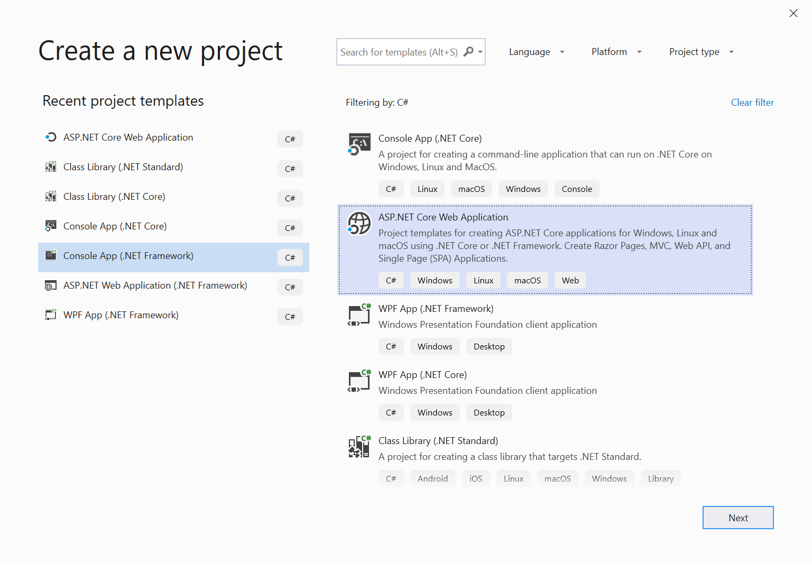
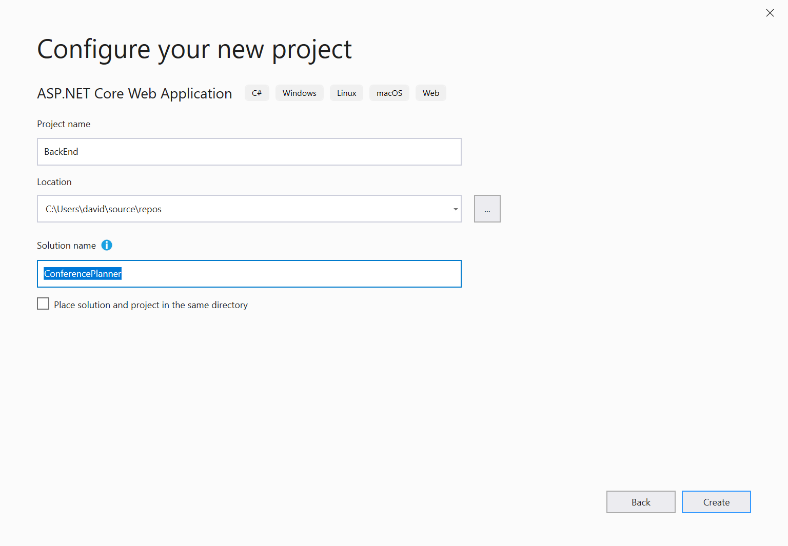
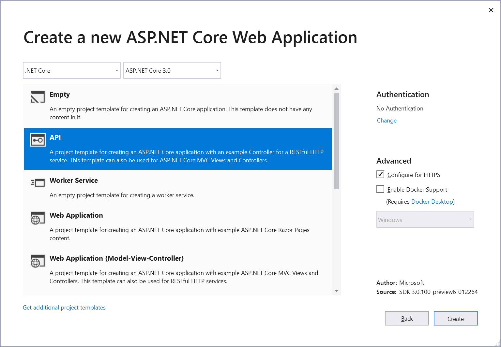

## Creating a new project using Visual Studio

1. Create and add a new project named BackEnd and name the solution ConferencePlanner using File / New / ASP.NET Core Web Application. Select the Web API template, No Auth, no Docker support.

> **Note:** If not using Visual Studio, create the project using `dotnet new webapi` at the cmd line, details as follows:
>
> i. Create folder ConferencePlanner and call `dotnet new sln` at the cmd line to create a solution
>
> ii. Create sub-folder BackEnd and create a project using `dotnet new webapi` at the cmd line inside the folder BackEnd
>
> iii. From the ConferencePlanner folder, add the project to the solution using `dotnet sln add BackEnd/BackEnd.csproj`
